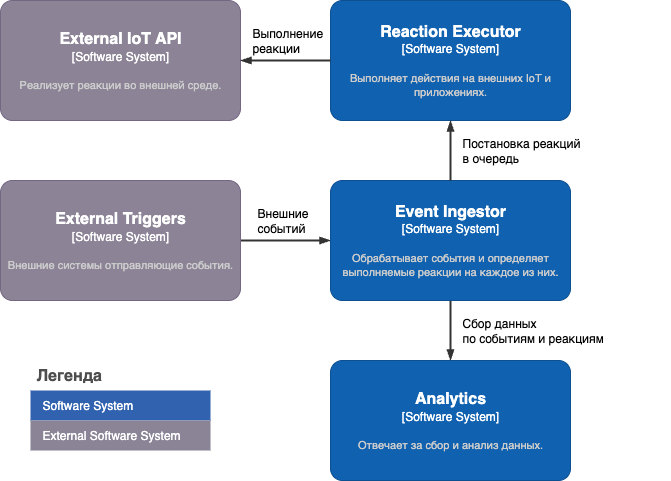
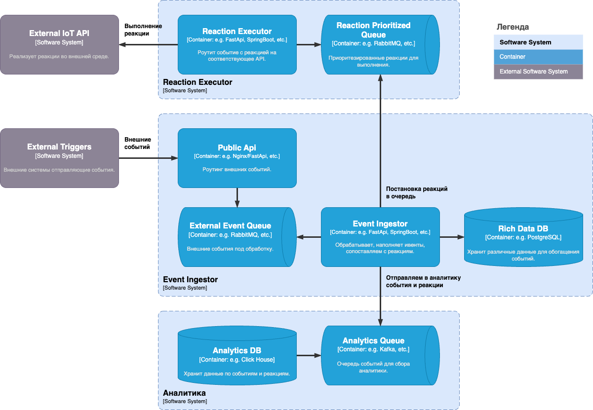

# Архитектура системы обработки событий

## Навигация

- **[← Главная](README.md)** - обзор тестового задания
- **[Требования](REQUIREMENTS.md)** - функциональные и нефункциональные требования
- **Архитектура** - компоненты системы и их взаимодействие  
- **[Качества системы](SQA.md)** - масштабирование, отказоустойчивость, производительность
- **[Мониторинг](MONITORING.md)** - метрики, логирование, алерты
- **[Вопросы](QUESTIONS.md)** - список вопросов для детализации требований

---

## Общая схема архитектуры

Система построена по принципу микросервисной архитектуры с асинхронной обработкой событий и горизонтальным масштабированием.

## Мотивация выбора архитектуры

### Event-Driven Architecture (EDA)
Выбор событийно-ориентированной архитектуры обусловлен обработкой потока событий в реальном времени.
- Компоненты независимы и могут развиваться отдельно
- Каждый компонент может масштабироваться независимо в зависимости от нагрузки
- Система реагирует на события по мере их поступления

### Микросервисная архитектура
Разделение функциональности по независимым сервисам обеспечивает гибкость и надежность.
- Каждый сервис может использовать оптимальный стек технологий
- Обновления одного сервиса не влияют на другие
- Отказ одного сервиса изолирован от остальных

### Асинхронная обработка с очередями
Обеспечивает надежность доставки и производительность системы.
- Очереди сглаживают пиковые нагрузки
- Сообщения не теряются при сбоях

## Компоненты

### Event Receiver (HTTP API)
**Назначение**: Принимает входящие события от внешних источников (датчики IoT, веб-хуки, API).
- Python/FastApi, Java/Spring Boot, etc.
- Nginx для load balancing

### Event Processor
**Назначение**: Основной компонент для обработки, валидации и обогащения событий.
- Python/FastAPI, Java/Spring Boot, etc.

### Reaction Queue / External Event Queue (RabbitMQ)
**Назначение**: Асинхронная передача событий между компонентами, поддержка приоритетов.
- Поддержка очередей с приоритетами для критичных реакций
- Встроенная поддержка retry логики и dead letter queues

### Analytics Queue (Kafka)
**Назначение**: Асинхронная передача событий для аналитики.
- Интеграции с ClickHouse из коробки.

### Data Storage (PostgreSQL)
**Назначение**: Хранение событий, конфигураций правил и метаданных. Для части кейсов может быть заменен Redis.
- Эффективная работа с двумя типами данных: персональными (долгосрочное хранение) и временными (кратковременное хранение)
- Встроенные возможности для партиционирования по разным критериям, включая время
- Универсальный вариант для данных без понятной логики поиска
- JSON поддержка для гибких схем событий

### Reaction Executor
**Назначение**: Выполнение реакций на события (уведомления, API-вызовы, запись в БД).
- Python/FastApi, Java/Spring Boot, etc.

## Реализация функциональных требований

### 1. Прием событий (до 5 000 событий/сек)
- **Event Receiver** с горизонтальным масштабированием (несколько инстансов за Nginx Load Balancer)
- **Асинхронная обработка**: События сразу помещаются в очереди без блокировки HTTP-запроса
- **Быстрый ответ клиенту**: HTTP 200/202 возвращается сразу после валидации и постановки в очередь

### 2. Запись в аналитическую БД (каждое событие)
- **Analytics Queue (Kafka)** обеспечивает надежную доставку в аналитическую систему
- **Интеграция с ClickHouse** из коробки для высокопроизводительной аналитики
- **Гарантированная доставка**: Kafka обеспечивает durability и replication

### 3. Обработка и обогащение данных
- **Event Processor** выполняет валидацию, трансформацию и обогащение
- **Конфигурируемая обработка**: "as is" или с обогащением в зависимости от настроек
- **Кэширование правил** в Redis для быстрого доступа

### 4. Система реакций (до 5 реакций на событие)
- **Reaction Queue (RabbitMQ)** с поддержкой приоритетов
- **Reaction Executor** масштабируется в зависимости от количества реакций

### 5. Обеспечение отказоустойчивости
- **Circuit Breaker** паттерн для внешних интеграций
- **Dead Letter Queues** для неуспешных реакций
- **Retry механизмы** с экспоненциальным backoff
- **Изоляция сбоев**: Недоступность внешней системы не влияет на обработку событий

## Предположения
- **Авторизация внешних триггеров**: Процесс авторизации внешних триггеров не рассматривается, рейт-лимитирование пропущенно
- **Сбор данных с датчиков**: Предполагается, что сбор данных с датчиков и преобразование в события уже реализован во внешней среде и данные поступают через HTTP
- **Обогащение данных**: Процесс заполнения данных для обогащения не детализирован, поскольку требует понимания специфики конкретных типов данных
- **Обогатитель событий**: Функционал обогащения может быть выделен в отдельный шаг, но в рамках текущего решения интегрирован в Event Processor для упрощения архитектуры
